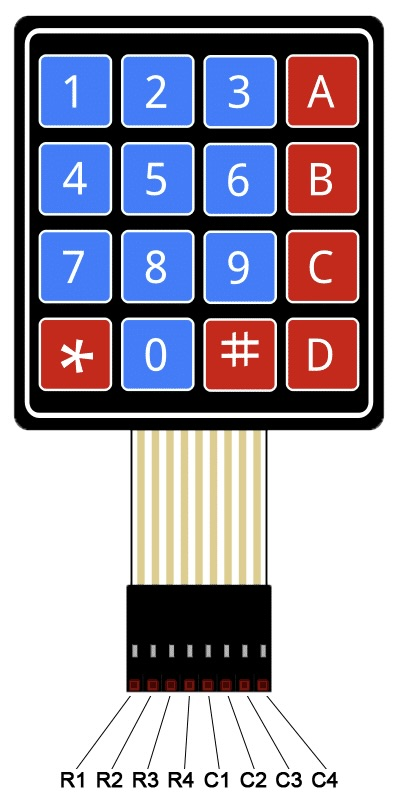
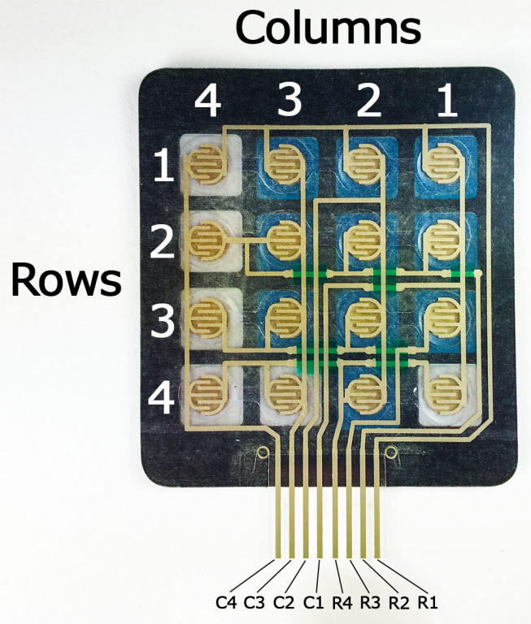

# Compte-rendu Projet IOT KeyPad

## Sommaire
- [Compte-rendu Projet IOT](#compte-rendu-projet-iot)
  - [Projet KeyPad STM32](#projet-keypad-stm32)

## Projet KeyPad STM32

Notre projet consiste à retranscrire les entrées d'un pavé numérique à l'aide de Putty. 

Pour ce faire nous avions un pavé numérique à 16 touches comme celui-ci : 



Les touches du pavé sont divisées en LIGNES et COLONNES et nous allons les utiliser pour savoir quelle touche a été enfoncée.

Comme le montre l'image ci-dessus, le clavier a 16 touches et elles sont divisées en 4 lignes et 4 colonnes. Toutes les touches d'un seul ROW sont interconnectées et toutes les touches d'un seul COL sont interconnectées aussi, comme indiqué dans l'image ci-dessous :



Chaque fois que la touche est enfoncée, la connexion entre ROW et COL est terminée et la broche COL affiche 0. Cela nous indiquera que ROW et COL sont tous les deux 0 (enfoncés) et nous saurons quelle touche a été pressé.

Nous commençons avec le bout de code suivant : 

```c
char read_keypad (void)
{
    HAL_GPIO_WritePin (GPIOA, R1_Pin, GPIO_PIN_SET);
	HAL_GPIO_WritePin (GPIOA, R2_Pin, GPIO_PIN_RESET);
	HAL_GPIO_WritePin (GPIOA, R3_Pin, GPIO_PIN_RESET);
	HAL_GPIO_WritePin (GPIOA, R4_Pin, GPIO_PIN_RESET);

	if (!(HAL_GPIO_ReadPin (GPIOC, C1_Pin)))
	{
		while (!(HAL_GPIO_ReadPin (GPIOC, C1_Pin)));
		return '1';
	}

	if (!(HAL_GPIO_ReadPin (GPIOC, C2_Pin)))
	{
		while (!(HAL_GPIO_ReadPin (GPIOC, C2_Pin)));
		return '2';
	}
	if (!(HAL_GPIO_ReadPin (GPIOA, C3_Pin)))
	{
		while (!(HAL_GPIO_ReadPin (GPIOA, C3_Pin)));
		return '3';
	}
	if (!(HAL_GPIO_ReadPin (GPIOA, C4_Pin)))
	{
		while (!(HAL_GPIO_ReadPin (GPIOA, C4_Pin)));
		return 'C';
	}
```

Ici, nous définissons d'abord ROW1 enfoncée et toutes les autres ROW comme relâchées. Si COL1 est enfoncée, cela signifie que la touche enfoncée est '1', si le COL2 est enfoncée, cela signifie que la touche enfoncée est '2' et ainsi de suite.
De même, nous procédons ainsi pour d'autres ROW jusqu'à ce que toutes les ROW soient couvertes.

Pour la deuxième ligne du pavé : 

```c
    HAL_GPIO_WritePin (GPIOA, R1_Pin, GPIO_PIN_RESET);
	HAL_GPIO_WritePin (GPIOA, R2_Pin, GPIO_PIN_SET);
	HAL_GPIO_WritePin (GPIOA, R3_Pin, GPIO_PIN_RESET);
	HAL_GPIO_WritePin (GPIOA, R4_Pin, GPIO_PIN_RESET);

	if (!(HAL_GPIO_ReadPin (GPIOC, C1_Pin)))
	{
		while (!(HAL_GPIO_ReadPin (GPIOC, C1_Pin)));
		return '4';
	}

	if (!(HAL_GPIO_ReadPin (GPIOC, C2_Pin)))
	{
		while (!(HAL_GPIO_ReadPin (GPIOC, C2_Pin)));
		return '5';
	}
	if (!(HAL_GPIO_ReadPin (GPIOA, C3_Pin)))
	{
		while (!(HAL_GPIO_ReadPin (GPIOA, C3_Pin)));
		return '6';
	}
	if (!(HAL_GPIO_ReadPin (GPIOA, C4_Pin)))
	{
		while (!(HAL_GPIO_ReadPin (GPIOA, C4_Pin)));
		return 'D';
	}
```

Pour la troisième ligne du pavé : 

```c
    HAL_GPIO_WritePin (GPIOA, R1_Pin, GPIO_PIN_RESET);
	HAL_GPIO_WritePin (GPIOA, R2_Pin, GPIO_PIN_RESET);
	HAL_GPIO_WritePin (GPIOA, R3_Pin, GPIO_PIN_SET);
	HAL_GPIO_WritePin (GPIOA, R4_Pin, GPIO_PIN_RESET);

	if (!(HAL_GPIO_ReadPin (GPIOC, C1_Pin)))
	{
		while (!(HAL_GPIO_ReadPin (GPIOC, C1_Pin)));
		return '7';
	}

	if (!(HAL_GPIO_ReadPin (GPIOC, C2_Pin)))
	{
		while (!(HAL_GPIO_ReadPin (GPIOC, C2_Pin)));
		return '8';
	}
	if (!(HAL_GPIO_ReadPin (GPIOA, C3_Pin)))
	{
		while (!(HAL_GPIO_ReadPin (GPIOA, C3_Pin)));
		return '9';
	}
	if (!(HAL_GPIO_ReadPin (GPIOA, C4_Pin)))
	{
		while (!(HAL_GPIO_ReadPin (GPIOA, C4_Pin)));
		return 'E';
	}
```

Et pour la dernière ligne du pavé numérique : 
```c 
    HAL_GPIO_WritePin (GPIOA, R1_Pin, GPIO_PIN_RESET);
	HAL_GPIO_WritePin (GPIOA, R2_Pin, GPIO_PIN_RESET);
	HAL_GPIO_WritePin (GPIOA, R3_Pin, GPIO_PIN_RESET);
	HAL_GPIO_WritePin (GPIOA, R4_Pin, GPIO_PIN_SET);

	if (!(HAL_GPIO_ReadPin (GPIOC, C1_Pin)))
	{
		while (!(HAL_GPIO_ReadPin (GPIOC, C1_Pin)));
		return 'A';
	}

	if (!(HAL_GPIO_ReadPin (GPIOC, C2_Pin)))
	{
		while (!(HAL_GPIO_ReadPin (GPIOC, C2_Pin)));
		return '0';
	}
	if (!(HAL_GPIO_ReadPin (GPIOA, C3_Pin)))
	{
		while (!(HAL_GPIO_ReadPin (GPIOA, C3_Pin)));
		return 'B';
	}
	if (!(HAL_GPIO_ReadPin (GPIOA, C4_Pin)))
	{
		while (!(HAL_GPIO_ReadPin (GPIOA, C4_Pin)));
		return 'F';
	}
// dans les autres cas, on retourne 'Z'
	return 'Z';
}
```

Pour finir, nous devons permettre à Putty de recevoir les informations données : 

```c 
  /* Infinite loop */
  /* USER CODE BEGIN WHILE */
	ecris_txt("Debut projet\n\r");
	while (1)
	{
		char car;
		char message[30];
		car=read_keypad();
		sprintf(message, "Caractere recu : %c\n\r");
		ecris_txt(message);
    /* USER CODE END WHILE */

    /* USER CODE BEGIN 3 */
	}
  /* USER CODE END 3 */
}
```

Malheureusement, nous n'avons pas réussi à faire fonctionner ce projet. Putty recevait des caractères mais cela ne correspondait pas aux touches pressées sur le pavé numérique : 


